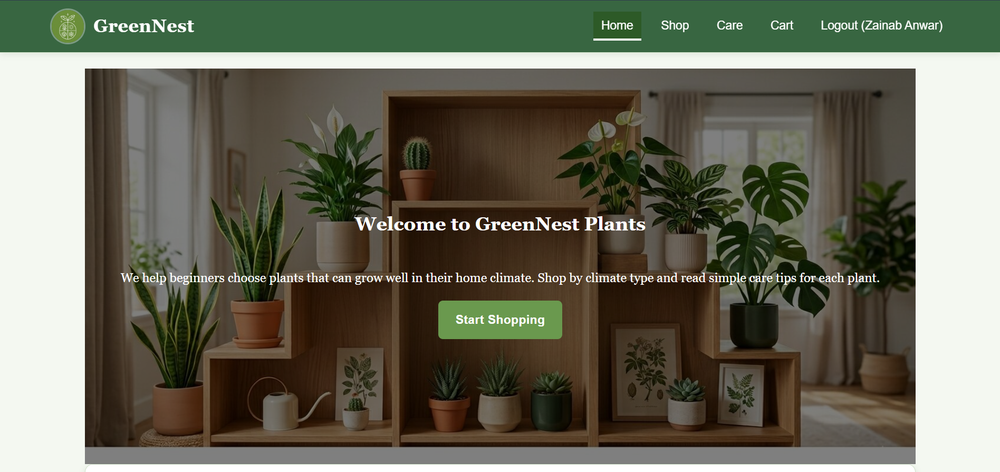
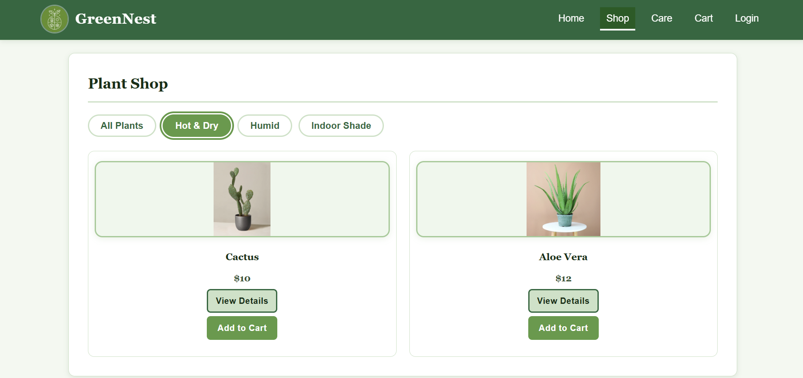
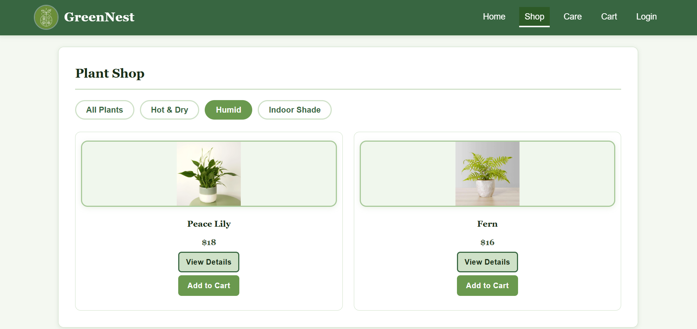
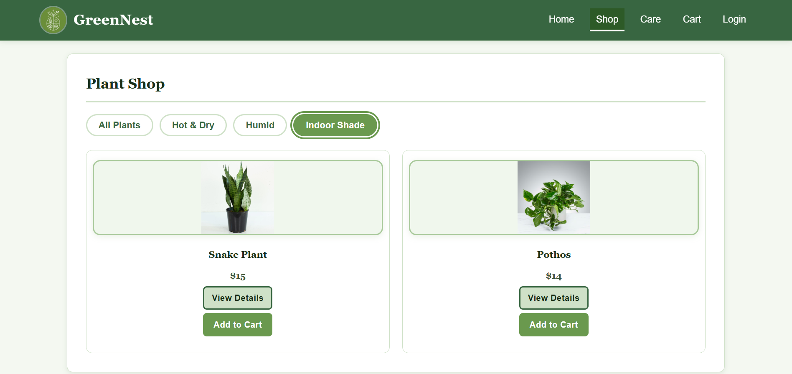
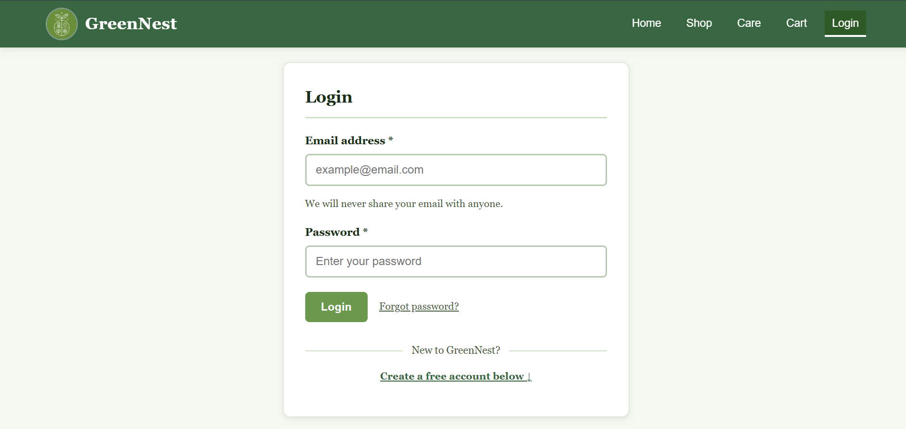

 ## Introduction

GreenNest Plants :
 this is a super simple plant shop website designed for new owners to find the right plants suited for their specific climate.

Instead of overstimulating users with too many options, GreenNest simplifies everything,
Users Choose their climate (Hot & Dry, Humid or Indoor Shade)
and the providing plants that are good for gardening tips care and order of the particular plant.

This project was the prototype of a static HTML/CSS app and we added JavaScript to simulate actual shopping behavior, such as: 
form validation, climate-based filtering, and cart functionality.

## users can:
Browse plants based on climate
Applying The Plants Care (Tips)
Add plants to a shopping cart
Adjust quantities and view totals

## Pages Overview

index. html: Homepage containing hero section, climate selector and featured plants
shop. html: shows all plants with details (light, water, climate)
care. html: Beginner-friendly plant care guide
cart. html: Build a Dynamic cart using Javascript + localStorage
login. html: Login & signup/user registration UI with validation
css/style. css: All styles (colors, layout, responsiveness)
js/main. js: JavaScript for validation and cart function

## How the website operates:

This was originally a completely static project but has now added:

Form Validation
Prevents empty email/password submission
Gives instant feedback using alerts
Better user experience with no backend
Shopping Cart (localStorage)
The items are saved into the browser
Quantity updates dynamically
Cart continues to work with a page refresh

## Cart Features
Add items
Increase/decrease quantity
Auto total calculation
Item count tracking

## Tech Used
HTML5 for the semantic structure
CSS3 for Flexbox, Responsive Design, and CSS Variables and styling
JavaScript (Vanilla) for Adding interactivity and cart logic
LocalStorage API to save information about the cart

No backend or database (this is still a front-end prototype only.)

## Design Decisions
Color Palette:
Green (#6a994e) → brand identity
Dark green (#386641) → contrast
Light background (#f0f7ed) → clean, natural feel
Typography:
Georgia → headings (soft, organic)
Arial → UI text (clear & readable)
Layout:
Flexible card grid (responsive)
Max width: 1050px centered
Maintainability:
CSS variables used for easy updates
Accessibility (WCAG 2.1 AA)

This part of the project has been constructed with accessibility in focus:

## Navigation
Skip link for keyboard users
All interactive elements have focus outlines
aria-current for active page
Structure
Semantic tags (header, main section etc.)
labels to help people using screen readers move through pages easily
Forms
Proper labels and input connecting
Required fields are clearly showing
Helpful hints are available, using aria-describedby
Visual Accessibility
High contrast text (AA/AAA compliant)
Clear readable font sizes

## User Flow
Home Page> Choose Climate / Start Shopping> Shop Page> Add to Cart>
Cart Page> Checkout> Login / Register

##  Screenshots

### Home Page

### Shop Page

### hot and dry plants

### humid plants

### indoor shade plants

### Cart Page

### Login Page

### Care Guide

## Limitations
No real payment system (you can't go forward with ordering and payment)
No database
the Login is not authenticated
Cart is browser-only 
No advanced filtering yet

## Future Improvements

if we continued this project:

Adding backend and database (Node.js / Firebase)
authenticating the login and adding accounts
Real checkout system/ payment
Better UI animations
Mobile-first improvements

## Project Structure
plant_shop_project/
- index.html
- shop.html
- care.html
- cart.html
- login.html
- css/
    - style.css
- js/
    - script.js
- README.md

## Final Notes!!!!

This project started as a simple HTML/CSS assignment but evolved into something more interactive with JavaScript!
 It clearly shows:
UI/UX thinking
Accessibility awareness and consideration
Clean structure
Beginner-friendly interactivity 

GreenNest Plants / 2026 